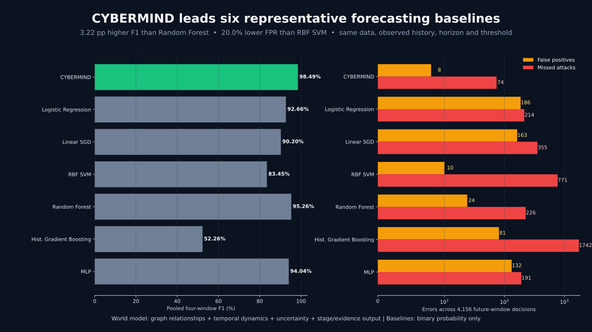

# SIH Baseline Suite — Presentation Artifact

## The slide headline

> **CYBERMIND leads every evaluated nontrivial baseline across F1, precision, recall, false-positive rate and average precision on the same held-out four-window forecasting protocol.**

## Result table

| Model | Precision | Recall | F1 | FPR | AP | FP | Misses |
|---|---:|---:|---:|---:|---:|---:|---:|
| CYBERMIND | 99.70% | 97.30% | 98.49% | 0.56% | 99.85% | 8 | 74 |
| Always Benign | 0.00% | 0.00% | 0.00% | 0.00% | 65.93% | 0 | 2740 |
| Logistic Regression | 93.14% | 92.19% | 92.66% | 13.14% | 98.07% | 186 | 214 |
| Linear SGD | 93.60% | 87.04% | 90.20% | 11.51% | 95.58% | 163 | 355 |
| RBF SVM | 99.49% | 71.86% | 83.45% | 0.71% | 97.76% | 10 | 771 |
| Random Forest | 99.05% | 91.75% | 95.26% | 1.69% | 98.28% | 24 | 226 |
| Histogram Gradient Boosting | 92.49% | 36.42% | 52.26% | 5.72% | 89.17% | 81 | 1742 |
| MLP | 95.08% | 93.03% | 94.04% | 9.32% | 98.66% | 132 | 191 |

Always-Benign is a sanity reference: its zero FPR comes from detecting no attacks and therefore has zero recall and zero F1.

## What to say in the presentation

> We compared CYBERMIND against six representative baselines using exactly the same training split, observed history, four unseen future windows and fixed decision threshold. The closest baseline was Random Forest at 95.26% F1. CYBERMIND reached 98.49% while reducing the false-positive rate below even the conservative RBF SVM. Across 4,156 future decisions, CYBERMIND produced only eight false alarms and 74 misses. It also provides network-stage, uncertainty, host evidence and intervention outputs that binary classifiers cannot provide.

## Recommended PPT placement

Use this as the central evidence slide immediately after the architecture slide. Reveal the F1 chart first, then the error chart, and finish with the capability line. Keep the model names and shared-protocol statement visible so reviewers can see that the comparison is fair.

## Defensible efficiency message

CYBERMIND's demonstrated efficiency is operational: fewer false alerts, fewer missed attacks and several analyst outputs from one 925,064-parameter, 10.69 MB checkpoint. The report does not claim lower arithmetic cost than linear models.

## Evidence boundary

This is a representative fixed-hyperparameter suite, not a claim against every published IDS or every possible tuned implementation. Models were configured before the suite was run and were not tuned on test results. Raw metrics, confusion counts, per-horizon results, input hashes and protocol hashes are retained in `results/final_grouped/baseline_suite.json` and `baseline_suite_comparison.json`.
