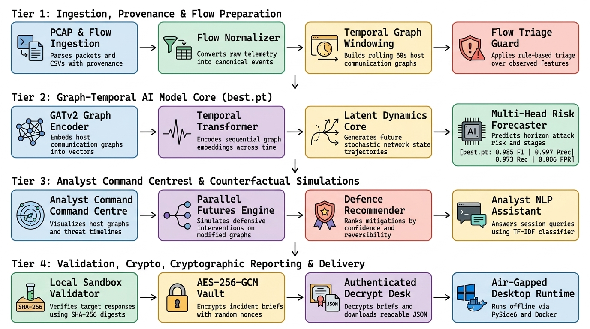

# CYBERMIND demo — maximum two minutes

**Target length:** 1:55–2:00. Read the narration continuously at approximately 130 words per minute. The time marks guide the live demonstration; they are not spoken pauses. Use only the user's narration. Record a new take of this shorter script; the earlier audio follows the longer version.

## Continuous narration

An attack unfolds through hosts and connections while defenders piece together what happened. SIH26153 asks us to anticipate what comes next. CYBERMIND is our offline answer.

In Command Centre, I upload captured traffic and select a host to inspect its connections. Live Monitor follows activity over time. Flagged Flows exposes endpoints, ports, volumes and observed-risk hints; these are separate from model forecasts.

Threat Forecast projects future graph-window risk, coarse attack stages and uncertainty. Attack Graph shows relationships, while Benchmark presents the saved held-out evaluation. In Parallel Futures, I compare a defensive intervention with the no-action baseline. These are simulations for analyst review.

The Validation Engine freezes the forecast and records actual sandbox responses and hashes. The floating offline assistant answers questions about this case.

In Reports, I encrypt the incident brief and choose its save location. Here is the encrypted JSON. Using the separately held key, I decrypt it inside CYBERMIND, preview the readable report and download it.

Our architecture connects these steps. Tier One preserves provenance, normalizes flows and builds temporal communication graphs, with separate flow triage. Tier Two uses the pinned best.pt model: GATv2 encodes graphs, a temporal Transformer reads their sequence, latent dynamics project future states, and prediction heads estimate risk and stage. Tier Three powers investigation, counterfactual comparisons, defence suggestions and case-grounded questions. Tier Four records sandbox evidence and protects reports with AES-256-GCM and in-app decryption.

CYBERMIND runs offline on Windows through its desktop application and on Linux through Docker, linking evidence to what may happen next.

## Live demonstration and timing

| Time | Show the actual action and result |
|---|---|
| 0:00–0:12 | Opening problem visual using the specified Frame1 image. Briefly show Frame2 on “CYBERMIND is our offline answer,” then enter the full-screen application. |
| 0:12–0:32 | In Command Centre, use Upload to select a capture or flow CSV through File Explorer. Show the loaded graph and select a host. Move through Live Monitor and Flagged Flows; highlight a real row. Do not preload the file or advertise it as a sample. |
| 0:32–0:51 | Show the actual Threat Forecast curve, Attack Graph and saved Benchmark. Run Parallel Futures and hold on the baseline/intervention comparison. Cut processing waits beneath the continuous narration. |
| 0:51–1:01 | Run the local Validation Engine check and show returned HTTP codes and SHA-256 hashes. Ask the floating assistant “How many flows are loaded?” and show its answer. |
| 1:01–1:17 | Export the encrypted incident brief and choose a destination. Briefly open only that exported JSON in Notepad. Import it into the app's decrypter, enter the hidden key and show the readable preview and download result. |
| 1:17–1:55 | Display only the supplied architecture image from “Our architecture connects these steps” through the end. Use slight, stable reframing as each tier is narrated. Keep the entire diagram readable for the closing Windows/Linux line. |
| 1:55–2:00 | Hold on the architecture image. End by two minutes without an additional spoken outro. |

## Capture requirements

- Use live application recordings throughout the walkthrough. Preserve full-screen presentation and smooth transitions; use only slight zooms on the controls or results being discussed.
- Keep the report key, passwords and unrelated private files off camera. The only external views are the specified opening images, File Explorer picker, exported-report Notepad view and final architecture image.
- Show actual results. An unavailable control or failed sandbox response must not be replaced with a fabricated success. Local validation records sandbox behaviour; it does not establish model accuracy or retrain best.pt.
- Flow risk flags are rule-based hints. Unlabeled raw PCAP flows can remain Unassessed while graph-window forecasting runs. Model stages are coarse research estimates.
- If a real Strix run is available, briefly show it during the validation span with the subtitle: “Forecast frozen before an authorized sandbox probe; observed evidence can agree or disagree.” Otherwise show the working local check. Do not claim continuous model updating.
- After recording, verify the narration and final video duration are each no longer than 120 seconds. Trim processing waits before increasing voice speed.

## Architecture image

