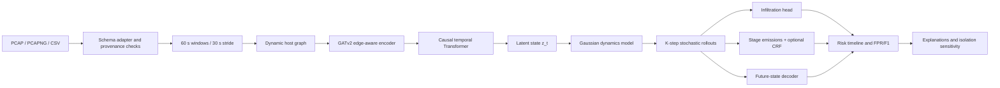

# CYBERMIND — Two-Page Architecture and Improvement Plan

**Problem statement:** SIH26153 — Predictive cyber defence with a network world model 
**Evidence date:** 26 September 2026 
**Scope:** Architecture document requested for the repository. The two-minute video and five-slide presentation are separate submission artifacts.

## Page 1 — System architecture

### Objective and operating model

CYBERMIND learns how a protected network changes over time instead of classifying each flow independently. Given observed graph states \(S_{t-H+1},\ldots,S_t\), it learns a latent transition distribution approximating \(P(z_{t+1}\mid z_t)\) and recursively simulates \(K\) possible future states. Each future state produces an infiltration probability, a coarse ATT&CK-aligned stage, rollout dispersion, and model-sensitivity evidence for an analyst. The system runs offline and now accepts a local PCAP, PCAPNG, CSV, or a reproducible prepared test sequence.

### Input and state representation

Hosts are graph nodes and observed communications are directed edges. Node features summarize packet and flow volume, peer and port diversity, protocol ratios, duration, inter-arrival time, activity rate, and packet statistics. Edge features include bytes, packets, protocol, port, direction, duration, inter-arrival time, TTL moments, TCP-window moments, fragmentation ratios, payload-size distribution, scan-order signals, and retransmission signals. Training-only means and standard deviations normalize every feature; the fingerprint is embedded in each checkpoint and checked again at inference.

The ingestion boundary is deliberately strict. Production checkpoints that require packet telemetry reject flow-only uploads. Inputs with missing timestamps or endpoint identities are rejected because chronological transitions and host graphs cannot be reconstructed faithfully. Uploaded labels are ignored during inference. CIC-IDS2018 labels remain attack-family labels, so stage supervision is a documented proxy mapping rather than native ATT&CK ground truth.

### Model and objective

GATv2 attention converts each variable-size graph into a graph representation. A causal temporal Transformer encodes the ordered graph history into latent states. The dynamics network predicts a diagonal-Gaussian next-state distribution; seeded sampling produces multiple repeatable futures. The stage decoder can apply a constrained linear-chain CRF that permits forward-or-stay progression, declared campaign resets, and an Unknown/Ambiguous state.

The improved training objective is:

\[
L=\lambda_dL_{Gaussian\ dynamics}+\lambda_sL_{future\ state}+\lambda_iL_{infiltration}
+\lambda_aL_{stage}+\lambda_cL_{CRF}+\lambda_bL_{Brier}+\lambda_gL_{consistency}.
\]

`L_future state` is newly connected to the explicit future-state decoder. Previously that head was serialized and displayed but received no loss gradient. Production configs now assign it weight `0.25`, and preflight requires a finite non-zero gradient through the head. Existing checkpoints remain usable, but the benefit of this repair requires retraining.

### Offline analyst interface

The Streamlit console accepts a trusted local checkpoint and either an uploaded capture/table or a prepared held-out case. It shows observed topology, a K-step risk and stage timeline, rollout standard deviation, transition legality, feature/attention sensitivity, and model-space host-isolation comparisons. It performs no network action. Temporary upload files are deleted after graph construction; inference does not require an external API.

---

## Page 2 — Evaluation, safeguards, evidence, and remaining work

### Leakage-safe evaluation

Evaluation now withholds the final \(K\) windows, supplies only `states[:-K]` to the model, and scores each future step in order. Reports include per-horizon and pooled precision, recall, F1, false-positive rate, average precision, stage accuracy, stage macro-F1, and illegal-transition rate. Expensive explanations are opt-in during bulk evaluation to reduce compute use.

The logistic comparison follows the same information boundary. One StandardScaler and one logistic head per horizon are fitted using only the training split. The feature-matched setting receives all node and edge columns plus fixed graph-topology summaries, but cannot reproduce graph message passing. Its threshold is fixed before test evaluation.

On the current stage-expansion test split of 394 sequences, using four unseen windows and threshold `0.5`, the selected epoch-9 world model produced:

| Model | Precision | Recall | F1 | FPR | AP |
|---|---:|---:|---:|---:|---:|
| World model, pooled K=4 | 0.9580 | 1.0000 | 0.9786 | 0.0477 | 0.9934 |
| Feature-matched logistic, pooled K=4 | 0.7491 | 0.9988 | 0.8561 | 0.3647 | 0.9826 |

The world model’s stage accuracy is `0.8401`, stage macro-F1 is `0.6008`, and decoded illegal-transition rate is `0.0` for this evaluation. At horizon four its infiltration F1 is `0.9761` and FPR is `0.0526`; the logistic baseline reaches F1 `0.8378` and FPR `0.4158`. Full machine-readable reports are stored in `results/stage_expansion/eval_test_k4.json` and `results/stage_expansion/baseline_test_k4.json`.

These are useful internal results, not proof of unseen-environment generalization. The chronological split comes from one CIC-IDS2018 environment, adjacent samples overlap, stages 3 (Lateral Movement) and 5 (Exfiltration) are absent from training, and the evaluated checkpoint predates the future-state-loss repair. No claim should extend beyond that evidence.

### Controls against overfitting

1. Split events chronologically before histories are formed, purge a full window at boundaries, and never randomly distribute rows from one episode across splits.
2. Fit normalization and class weights from training data only. Never tune a threshold on test labels.
3. Select checkpoints on validation metrics with early stopping; do not add epochs after validation stops improving.
4. Compare every candidate against the identical feature-matched logistic protocol and report confusion counts, FPR, and per-horizon degradation.
5. Use dropout, weight decay, gradient clipping, stochastic dynamics, and fixed seeds. Treat rollout variance as dispersion, not calibrated confidence.
6. Keep CTU-13 or another environment entirely held out. Report a flow-only external result separately when packet-feature parity cannot be established.

### Ordered improvement plan

| Priority | Improvement | Acceptance evidence |
|---:|---|---|
| 1 | Retrain the repaired combined model with edge features, CRF, and future-state loss; train a separate architecture baseline with both feature flags off | Two configuration-identified checkpoints, epoch reports, identical validation selection rules |
| 2 | Calibrate the operating threshold on a mixed-class validation split for a declared target FPR | Frozen threshold plus validation/test confusion matrices; no test tuning |
| 3 | Add genuine Lateral Movement and Exfiltration examples, or controlled labeled captures, without oversampling duplicates across splits | Non-zero train/validation/test support by stage and provenance hashes |
| 4 | Run external zero-shot evaluation | Dataset-specific report with feature-coverage differences stated explicitly |
| 5 | Replace the legacy directional PCAP exporter for future training with a verified bidirectional flow/packet join | Reverse traffic populates backward byte, packet, and IAT fields; deterministic capture tests pass |
| 6 | Distill/export only after the teacher is selected | CPU-only latency under 50 ms and artifact under 100 MB on the stated target machine |

The next training run should stop on validation evidence rather than a requested epoch count. The current 859,528-parameter checkpoint is approximately 10.4 MB because it includes optimizer/training state. A final inference-only state dictionary can be smaller, while the proposed full 512-wide GB10 teacher will be larger and should be distilled for the offline laptop artifact.

### Submission readiness boundary

The architecture now directly covers the world-model transition objective, K-step forecasting, packet/flow graph inputs, stage progression, explainability, offline PCAP/CSV ingestion, and the required logistic comparison. Final readiness still depends on producing the two mandatory comparable Phase 5 checkpoints, retraining after the state-head repair, demonstrating missing-stage and external-dataset behavior, and updating claims to those final measurements. The official reference is the [SIH26153 problem statement](https://sih.gov.in/sih2026PS#ViewProblemStatement26153).
